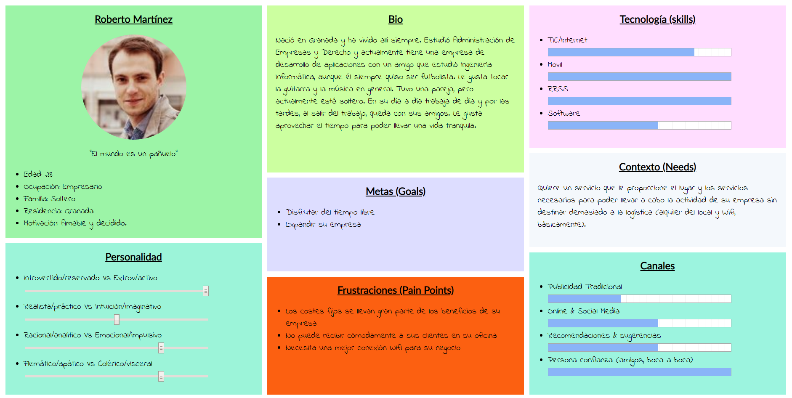
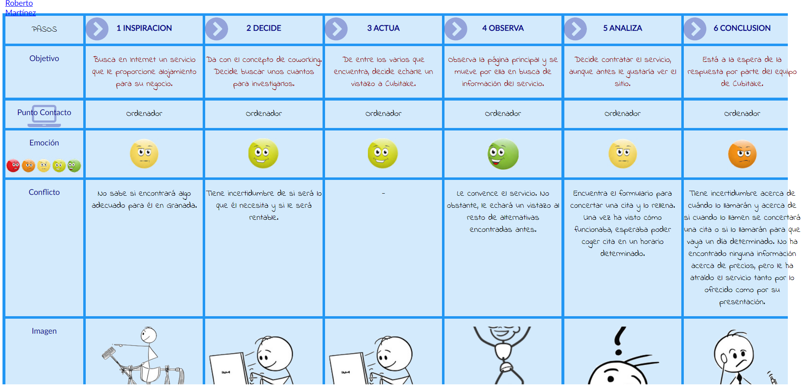

# DIU20
Prácticas Diseño Interfaces de Usuario 2019-20 (Economía Colaborativa) 

Examen final.  Curso: 2019/20. 

Proyecto: 
>>> Cubikate

Descripción: 

>>> Describa la idea de su producto en la práctica 2 

Logotipo: 
>>> Opcionalmente si diseña un logotipo para su producto en la práctica 3 pongalo aqui

Miembros
 * :bust_in_silhouette:   José Antonio Domínguez Gómez     :octocat:

----- 

>>> En esta práctica estudiaremos un caso de plataforma de economía colaborativa y realizaremos una propuesta para su diseño Web/movil. Utilizaremos herramientas y entregables descritos en el siguiente CheckList (https://github.com/mgea/UX-DIU-Checklist) Elimine este texto desde la práctica 1

Qué es economia colaborativa: Martínez-Polo, J. (2019). **El fenómeno del consumo colaborativo: del intercambio de bienes y servicios a la economía de las plataformas**, *Sphera Publica, 1*(19), 24-46. http://sphera.ucam.edu/index.php/sphera-01/article/view/363/14141434

>>> He subido el repositorio y no he hecho fork porque en las prácticas ya hice fork y no puedo volver a hacer otro del mismo repositorio.

# Proceso de Diseño 

## Paso 1. UX Desk Research & Analisis 

 1.a Competitive Analysis
-----

>>> Cubikate es una plataforma que proporciona un servicio de coworking. Básicamente consiste en el alquiler de un alojamiento físico para trabajar y de servicios como conexión a Internet, electricidad o cafetería, entre otras zonas comunes, a pequeñas empresas o trabajadores individuales para que puedan desarrollar su actividad.
>>>
>>> Concretamente, Cubikate ofrece un horario 24h, conexión Wifi de alta velocidad, mobiliario, impresora, fotocopiadora y escáner, espacios de relax, máquina de café y te y cocina, sala de reuniones y taquillas, además de los suministros y del servicio de limpieza.
>>>
>>> He escogido este servicio porque me parece la propuesta más interesante de entre las que he encontrado tanto por su estética y presentación al cliente como por los servicios ofrecidos, lo cual hace que esta propuesta sea la que más me ha llamado la atención y para la cual he podido formular una propuesta de valor más interesante para mejorar el negocio.

 1.b Persona
-----

>>> El perfil de esta persona es el de un empresario que necesita un espacio para llevar a cabo su actividad laboral para así ahorrar en costes, ganar en tranquilidad y obtener unos servicios de calidad (principalmente necesita el Wifi). He escogido a esta persona porque, de entre las que he considerado, he pensado que es la mejor elección para entender la problemática que pudiera haber al intentar utilizar el servicio.
>>>
>>> 

 1.c User Journey Map
----

>>> Se ha simulado el proceso de uso de la página web, https://cubikate.es/, para identificar problemas relacionados con la experiencia de usuario, pudiéndose, de esta manera, establecer puntos de mejoras y elaborar una propuesta de valor que resulte beneficiosa para la experiencia de usuario.
>>>
>>> 

 1.d Usability Review
----
>>> \-

## Paso 2. UX Design  

 2.a Feedback Capture Grid
----

 Interesante | Críticas     
| ------------- | -------
  Preguntas | Nuevas ideas

!! Propuesta de valor
----

>>> He podido observar que el alquiler de salas de reuniones y oficinas está sujeto a un formulario, mediante el cual se concierta una cita para acudir al edificio y, una vez allí, contratar el servicio. Mi propuesta de valor consiste en la inclusión de una aplicación móvil y web para llevar a cabo el proceso de concertar dicha visita y darse de alta y, una vez conocido al cliente y dado de alta, que éste pueda flexible y cómodamente contratar el alquiler de oficinas, reservar salas de reunión o ponerse en contacto de forma interactiva con el personal de Cubikate por alguna incidencia, con el fin de dinamizar el proceso y hacer más interactiva la experiencia del usuario.

 2.b Tasks & Sitemap 
-----

>>> \-

 2.c Labelling 
----

>>> \-

 2.d Wireframes
-----

>>> \-

## Paso 3. Mi equipo UX-Case Study 

 3.a ¿Como se cuenta un UX-Case Study?
-----

>>> \-

  3.b Logotipo
----

>>> \-

 3.c Guidelines
----

>>> \-

  3.d Video
----

>>> \-

## Paso 4. Evaluación 

 4.a Casos asignados
----

>>> \-

 4.b User Testing
----

>>> \-

. 4.c Ranking 
----

>>> \-

## Paso 5. Evaluación de Accesibilidad  

  5.a Accesibility evaluation Report
----

>>> \- 

## Conclusión final / Valoración de las prácticas

>>> \-

